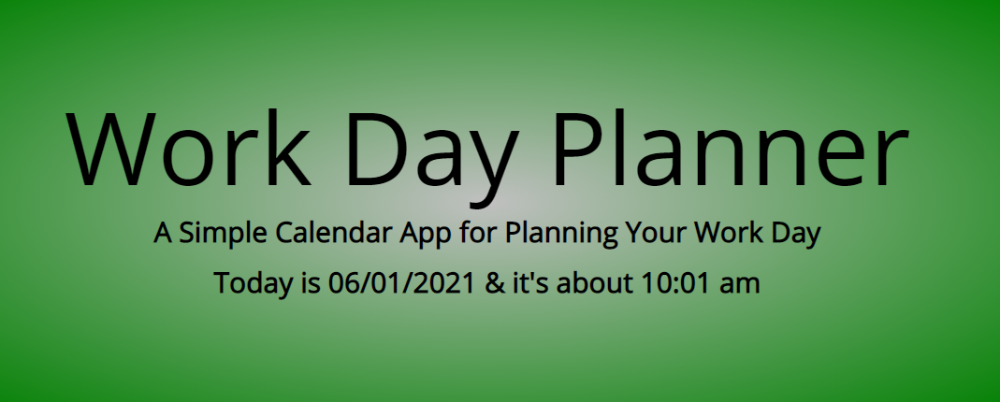
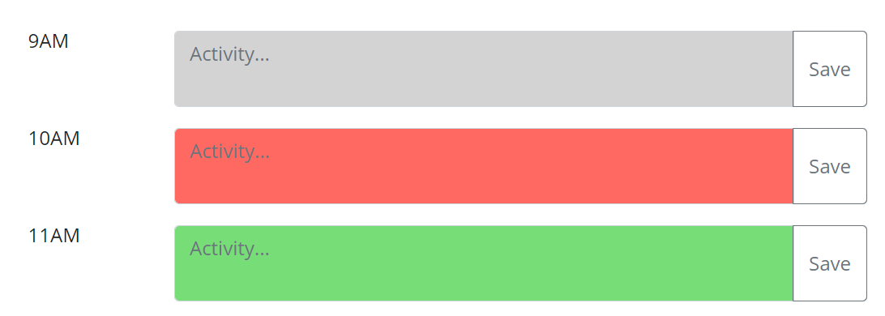
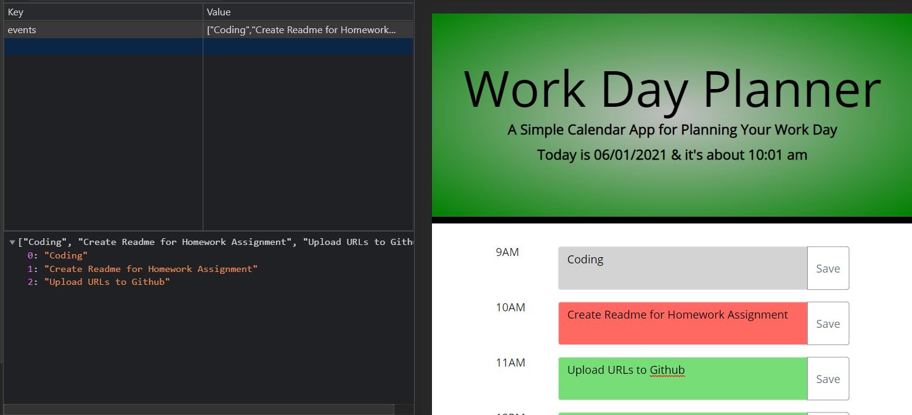
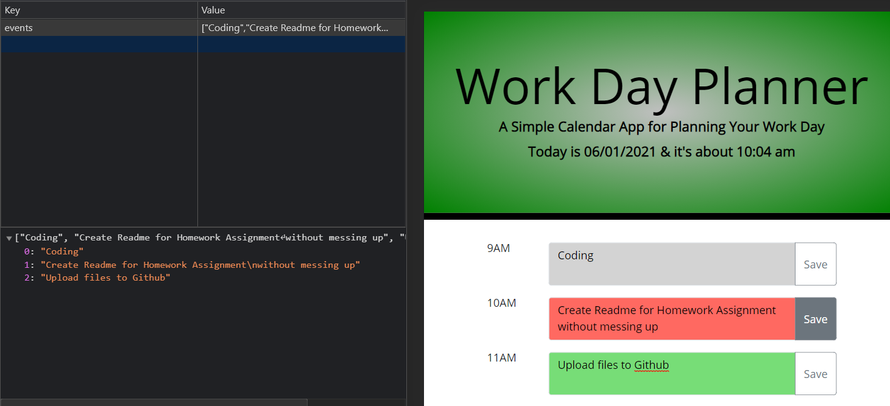

# 05 Third-Party APIs: Work Day Planner (Explanation ReadMe)

Link to Website: https://crowderyan.github.io/DayPlanner/

1. The current day is displayed at the top of the calendar

   

2. Timeblocks for standard business hours

   - A. Each timeblock is color coded to indicate whether it is in the past, present, or future

   

3. Entered event text is saved in local storage

   

   -Save button stores changes

   
